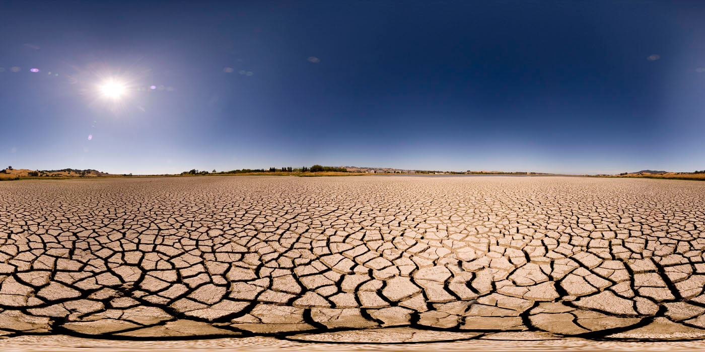

<div align="center">



# 🌍 Spatio-Temporal Machine Learning  
## Global Drought Forecasting

**A Step Ahead of Drought: Forecasting Global Water Storage Challenge**  
*Zindi Competition hosted in partnership with ITU and the United Nations*

<br>


<br><br>

<a href="https://zindi.africa/competitions/one-step-ahead-of-drought-forecasting-global-water-storage-challenge">
<b>View Competition on Zindi ↗</b>
</a>

</div>


---

# 🎯 Objective

The goal of this project was to forecast **Global Total Water Storage (TWS)** one month ahead using satellite-derived geospatial and climate data.

Accurate drought forecasting enables governments and organizations to identify early water depletion patterns and take preventive actions before severe socio-economic impacts occur.


---

# 🌍 Dataset Overview

The dataset contains more than **2.4 million spatio-temporal observations** covering the entire globe.

| Data Component | Description |
|---|---|
| 📍 Spatial Information | Latitude and longitude coordinates representing global locations |
| 💧 Total Water Storage | Target variable representing surface and groundwater availability |
| 🌧 Climate Indicators | Historical precipitation and soil moisture indexes across different time windows |
| 📅 Temporal Features | Monthly observations capturing seasonal and long-term climate patterns |


---

# 🏗️ Machine Learning Pipeline

The main challenge was combining **geographical information** with **time-dependent forecasting** while avoiding future information leakage.


---

# 🔧 Methodology

## 1. Spatio-Temporal Missing Data Handling

Real-world satellite datasets often contain missing measurements due to sensor limitations.

To address this issue, I implemented a **spatio-temporal forward fill strategy**:

- Data was grouped by exact geographic coordinates.
- Observations were sorted chronologically.
- Missing values were replaced using the latest available measurement.

This approach respects the physical behavior of water systems, where storage levels typically change gradually rather than randomly.


---

## 2. Domain-Specific Feature Engineering

Instead of relying only on raw measurements, additional features were created to capture drought dynamics.


### 📉 Drought Momentum

Measures whether a region is becoming progressively drier:

```
Short-term precipitation trend - Long-term precipitation trend
```


### 💧 Surface vs Groundwater Interaction

Estimated groundwater variation by comparing:

```
Total Water Storage - Surface Soil Moisture
```


### 📅 Seasonality

Extracted temporal patterns:

- Month
- Seasonal cycles
- Regional climate behavior


---

# 🧪 Validation Strategy

## Preventing Time-Series Leakage

A traditional random train/test split would allow the model to learn information from the future.

Instead, I implemented **Out-of-Time Cross Validation**:

- Data grouped by `Year-Month`
- Entire months held out during validation
- Model evaluated on unseen future periods


This better simulates real-world deployment where future water storage values are unknown.


---

# 🤖 Model Selection

## LightGBM Gradient Boosting

LightGBM was selected because it provides an excellent balance between:

✅ Predictive performance  
✅ Training speed  
✅ Memory efficiency  
✅ Ability to model nonlinear relationships


Tree-based models can naturally learn interactions between:

- Latitude / Longitude
- Climate conditions
- Seasonal patterns
- Regional drought behavior


without requiring complex spatial transformations.


---

# 📊 Results

| Evaluation | RMSE | Description |
|---|---:|---|
| Out-of-Time Validation | **0.52** | Realistic simulation of future forecasting performance |
| Public Leaderboard | **0.72** | Competitive Zindi benchmark score |

The final solution achieved a strong competitive performance by combining:

- robust temporal validation
- domain-driven feature engineering
- efficient gradient boosting modeling


---

# 🛠️ Tech Stack

| Category | Tools |
|---|---|
| Language | Python |
| Machine Learning | LightGBM |
| Data Processing | Pandas, NumPy |
| Geospatial Analysis | GeoPandas, Satellite Data |
| Validation | Time-based Cross Validation |
| Competition Platform | Zindi |


---

# 📌 Key Takeaways

This project demonstrates how traditional machine learning models can effectively solve complex geospatial forecasting problems when combined with:

- correct validation strategies
- domain knowledge
- physically meaningful feature engineering

The main lesson: **better data understanding often matters more than model complexity.**
